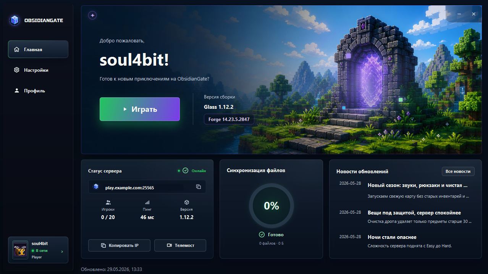
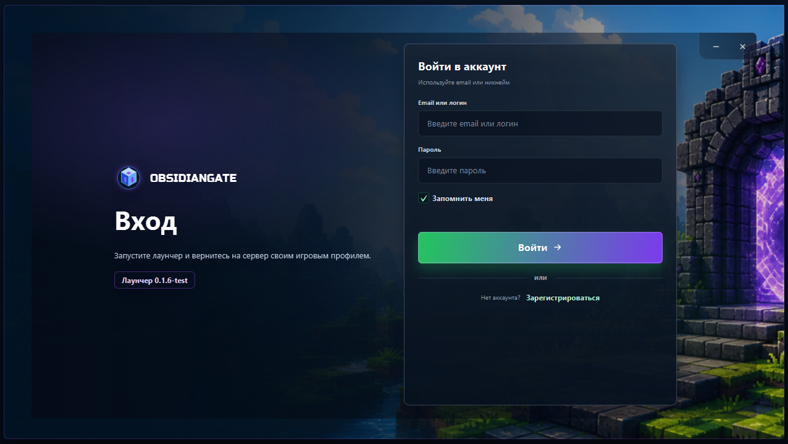
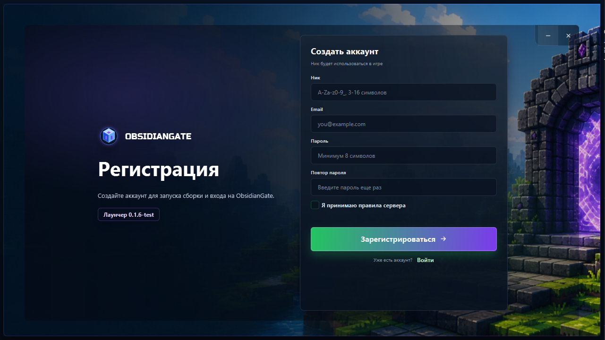
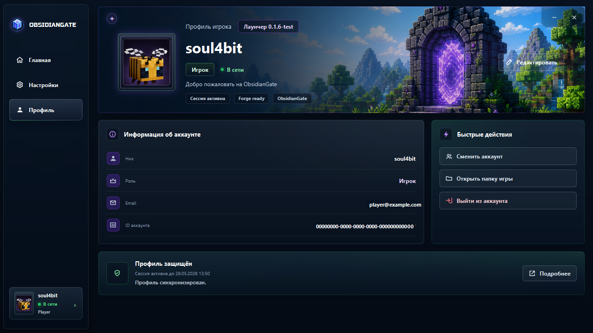
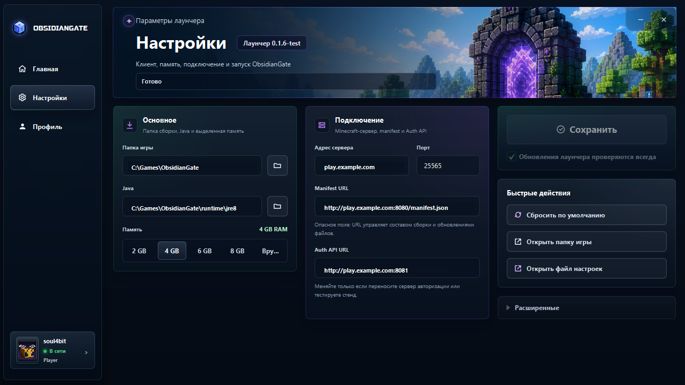

# ObsidianGate

ObsidianGate - это набор компонентов для Minecraft 1.12.2 сервера: JavaFX-лаунчер, сервер авторизации, Forge-моды для передачи игровых ticket и директория подготовки модпака.

Проект закрывает полный путь игрока: вход в лаунчер, синхронизация клиента по `manifest.json`, запуск Forge, выдача одноразового игрового ticket и проверка этого ticket на сервере.

## Содержание

- [Скриншоты лаунчера](#скриншоты-лаунчера)
- [Компоненты](#компоненты)
- [Быстрый старт](#быстрый-старт)
- [Конфигурация лаунчера](#конфигурация-лаунчера)
- [Manifest модпака](#manifest-модпака)
- [Поток авторизации](#поток-авторизации)
- [Релиз и деплой](#релиз-и-деплой)
- [Приватные адреса](#приватные-адреса)
- [Структура проекта](#структура-проекта)

## Скриншоты лаунчера

### Главный экран



### Вход и регистрация





### Профиль игрока



### Настройки




## Компоненты

- `src/` - JavaFX-лаунчер.
- `auth-api/` - Spring Boot API для аккаунтов, JWT и игровых ticket.
- `game-auth-common/` - Java 8 совместимый общий модуль для session/ticket логики.
- `forge-auth-client/` - клиентский Forge 1.12.2 мод, который отправляет ticket на сервер.
- `forge-auth-server/` - серверный Forge 1.12.2 мод, который проверяет ticket через Auth API и содержит серверные команды.
- `modpack/` - директория подготовки клиентских и серверных файлов модпака.
- `scripts/` - скрипты релиза и деплоя.
- `launcher/windows/` - Windows-загрузчик для скачивания и запуска лаунчера.

## Что умеет лаунчер

- Загружает `manifest.json` по HTTP(S).
- Проверяет detached Ed25519-подпись `manifest.json.sig` встроенным публичным ключом.
- Синхронизирует файлы клиента по SHA-256 и размеру.
- Скачивает переносимую Java, если она описана в manifest.
- Добирает официальную подготовку Minecraft/Forge, если она описана в manifest.
- Показывает новости, список изменений, статус сервера и прогресс синхронизации.
- Создает одноразовый игровой ticket для авторизованного игрока.
- Пишет `.obsidiangate/session.json` в папку игры.
- Запускает клиент через настраиваемый `launchTemplate`.
- Хранит локальные настройки в `~/.obsidian-gate-launcher/launcher.properties`.

## Требования

- Java 17 для лаунчера и `auth-api`.
- Java 8 совместимость для Forge-модов Minecraft 1.12.2.
- Maven 3.9+.
- HTTP(S)-раздача `manifest.json` и файлов модпака.
- PostgreSQL для `auth-api`.

## Быстрый старт

Запуск лаунчера из исходников:

```bash
mvn javafx:run
```

Сборка лаунчера:

```bash
mvn package
```

Запуск собранного лаунчера:

```bash
java -jar target/obsidian-gate-launcher-0.1.6-test.jar
```

Сборка Auth API:

```bash
mvn -f auth-api/pom.xml clean package
```

Сборка общих и Forge-модулей:

```bash
mvn -f game-auth-common/pom.xml install
mvn -f forge-auth-client/pom.xml clean package
mvn -f forge-auth-server/pom.xml clean package
```

Тесты основного лаунчера:

```bash
mvn test
```

Integration-тесты Auth API используют PostgreSQL 16 через Testcontainers, применяют
настоящие Flyway-миграции и проверяют конкурентную одноразовую верификацию game ticket:

```bash
mvn -f auth-api/pom.xml test
```

Для PostgreSQL-набора нужен доступный Docker daemon. Без Docker эти тесты помечаются как skipped.

## Конфигурация лаунчера

Файл настроек:

```text
~/.obsidian-gate-launcher/launcher.properties
```

Минимальный пример:

```properties
username=Player
java.command=java
game.directory=C:\\Users\\<user>\\rpg-client
working.directory=
server.host=play.example.com
server.port=25565
manifest.url=https://play.example.com:8080/manifest.json
auth.base.url=https://play.example.com:8081
server.id=obsidiangate-main
launch.template={java} -jar forge-1.12.2-14.23.5.2847.jar --username {username} --gameDir {gameDir} --server {serverHost} --port {serverPort}
update.files.before.launch=true
launcher.updates.enabled=true
```

Поддерживаемые подстановки в `launchTemplate`:

- `{java}`
- `{username}`
- `{gameDir}`
- `{workingDir}`
- `{serverHost}`
- `{serverPort}`
- `{uuid}`
- `{accessToken}`
- `{userType}`
- `{gameSessionFile}`

Если в шаблоне нет `{gameSessionFile}`, лаунчер сам добавит `-Dobsidiangate.sessionFile=...` сразу после Java-команды.

## Manifest модпака

Полный пример лежит в [examples/manifest.json](examples/manifest.json).

Лаунчер принимает manifest только вместе с корректной detached-подписью:

```text
manifest.json
manifest.json.sig
```

Подпись Ed25519 вычисляется над точными байтами `manifest.json`. Встроенный публичный ключ
лежит в `src/main/resources/ru/mcrpg/launcher/security/manifest-ed25519-public.pem`.
Поэтому SHA-256 файлов, runtime и обновления лаунчера доверяются только после проверки
подписи manifest.

Приватный ключ по умолчанию ожидается вне репозитория:

```text
~/.obsidiangate-release/manifest-ed25519-private.pem
```

Путь можно переопределить через `OBSIDIANGATE_MANIFEST_PRIVATE_KEY`. Первичная генерация
или намеренная ротация trust anchor:

```powershell
.\scripts\initialize-manifest-signing-key.ps1
```

Ротация требует выпуска нового лаунчера со свежим публичным ключом. Релизные скрипты
автоматически создают `manifest.json.sig`, а deploy-скрипты выкладывают оба файла.

Ключевые поля:

- `schemaVersion` - версия схемы, сейчас используется `1`.
- `baseUrl` - базовый URL для файлов клиента.
- `news` / `changelog` - новости и список изменений для главного экрана лаунчера.
- `history[]` - история обновлений.
- `launcher.serverHost` и `launcher.serverPort` - адрес подключения Minecraft.
- `launcher.authBaseUrl` - URL `auth-api`.
- `launcher.serverId` - идентификатор сервера для игрового ticket.
- `launcherUpdate` - новая версия launcher jar для самообновления.
- `runtime.packages[]` - переносимая Java.
- `minecraft` - настройки официальной подготовки Minecraft/Forge.
- `files[]` - файлы для синхронизации.

Минимальный пример:

```json
{
  "schemaVersion": 1,
  "id": "rpg",
  "version": "2026.05.29",
  "baseUrl": "https://play.example.com:8080/client/",
  "news": {
    "title": "Последние новости",
    "date": "2026-05-29",
    "body": "Коротко о последнем обновлении.",
    "highlights": ["Улучшена синхронизация клиента."]
  },
  "launcher": {
    "serverHost": "play.example.com",
    "serverPort": 25565,
    "authBaseUrl": "https://play.example.com:8081",
    "serverId": "obsidiangate-main",
    "workingDirectory": ".",
    "launchTemplate": ""
  },
  "files": [
    {
      "path": "mods/examplemod.jar",
      "sha256": "PUT_REAL_SHA256_HERE",
      "size": 54321
    }
  ]
}
```

## Поток авторизации

1. Игрок входит в аккаунт через лаунчер.
2. Лаунчер получает JWT от `auth-api`.
3. Перед запуском игры лаунчер создает одноразовый игровой ticket.
4. Лаунчер пишет `.obsidiangate/session.json` в папку игры.
5. Клиентский Forge-мод читает session-файл и после сетевого рукопожатия отправляет ticket на канал `ogauth`.
6. Серверный Forge-мод вызывает `POST /game/tickets/verify`.
7. Валидный ticket пропускает игрока, невалидный ticket приводит к разрыву соединения.

Игровой ticket живет 900 секунд по умолчанию, чтобы тяжелый Minecraft 1.12.2 клиент успевал загрузиться.

## Релиз и деплой

Подготовить auth-релиз:

```powershell
.\scripts\release-auth.ps1 -ManifestVersion 2026.05.29
```

Деплой auth-модулей:

```powershell
.\scripts\deploy-auth.ps1 -Target mc-rpg-deploy
```

Подготовить полный релиз модпака:

```powershell
.\scripts\release-modpack.ps1 -ClientSourceDir modpack/client -ManifestVersion 2026.05.29
```

Деплой полного модпака:

```powershell
.\scripts\deploy-modpack.ps1 -Target mc-rpg-deploy
```

Полный цикл одной командой:

```powershell
.\scripts\publish-modpack.ps1 -Target mc-rpg-deploy -ManifestVersion 2026.05.29
```

Первичная настройка SSH-псевдонима и деплоя без пароля:

```powershell
powershell -ExecutionPolicy Bypass -File .\scripts\setup-deploy-access.ps1 -Target minecraft@your.server.host -HostName your.server.host
```

После изменения `scripts/obsidiangate-remote-deploy.sh` повтори настройку, потому что сервер хранит свою копию обертки в `/usr/local/bin/obsidiangate-deploy`.

## Приватные адреса

В репозитории не должно быть реального домена, публичного IP, приватного IP сервера, паролей, JWT-секрета и `.env`.

Используй подстановочные значения:

- `play.example.com` - публичный домен в документации и примерах.
- `your.server.host` - адрес сервера для инструкций.
- `mc-rpg-deploy` - SSH-псевдоним для скриптов деплоя.

Перед публикацией удобно проверить:

```bash
rg "your-real-domain|your-real-ip|JWT_SECRET|DB_PASSWORD" .
```

Если реальный домен или IP уже попадал в GitHub, простой новый коммит убирает его только из актуальной версии. Для удаления из истории нужна отдельная перезапись истории через `git filter-repo` или BFG и принудительная отправка изменений.

## Структура проекта

```text
.
├─ auth-api/             Spring Boot API авторизации
├─ forge-auth-client/    клиентский Forge-мост авторизации
├─ forge-auth-server/    серверный Forge-мост и команды сервера
├─ game-auth-common/     общий Java 8 код ticket/session
├─ launcher/windows/     Windows-скрипты запуска
├─ modpack/              подготовка клиентского и серверного модпака
├─ scripts/              автоматизация релиза и деплоя
├─ src/                  JavaFX-лаунчер
└─ examples/             пример manifest
```

## Дополнительные README

- [auth-api/README.md](auth-api/README.md)
- [game-auth-common/README.md](game-auth-common/README.md)
- [forge-auth-client/README.md](forge-auth-client/README.md)
- [forge-auth-server/README.md](forge-auth-server/README.md)
- [modpack/README.md](modpack/README.md)
